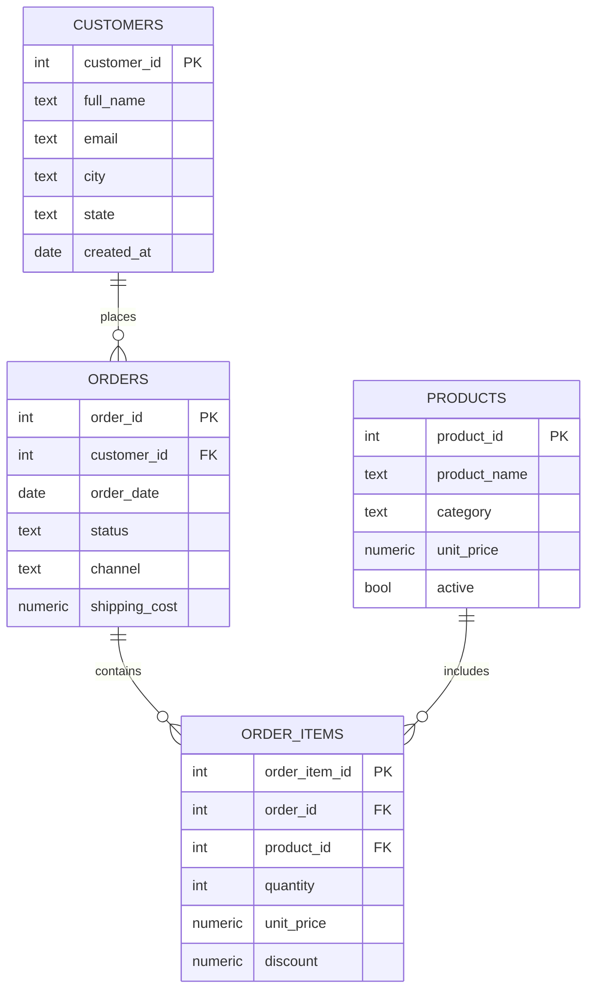

    # Retail Sales Analytics (Revenue, AOV, RFM, Cohorts)

    ## What this project demonstrates
    - Normalized sales schema (customers, orders, order_items, products)
- Data cleaning (trim, null handling, inferred missing prices)
- KPI reporting (revenue, AOV, repeat rate)
- Window functions (running totals, ranking)
- Basic cohort retention

    ## Business questions answered
    - What is total revenue and average order value (excluding returns/cancels)?
- Which categories/products drive revenue?
- How does revenue trend over time?
- Who are the best customers (RFM)?
- What does cohort retention look like by first purchase month?

    ## How to run (SQLite)
    1. Create `01_retail_sales_analytics/retail.db`
2. Run `sql/sqlite/01_create_tables.sql`
3. Import CSVs from `data/raw/` into matching tables
4. Run `sql/sqlite/03_cleaning.sql` then `sql/sqlite/04_analysis.sql`

    ## How to run (PostgreSQL)
    1. Create schema with `sql/postgres/01_create_tables.sql`
2. Load CSV via `sql/postgres/02_load_data.sql` (psql `\copy`)
3. Run `03_cleaning.sql` then `04_analysis.sql`

    ## Deliverables to screenshot for your GitHub page
    - Schema (table list + key columns)
    - 2–3 KPI result tables (from `04_analysis.sql`)
    - One “insight” query output (top segment / churn drivers / no-show drivers)

## Schema (ERD)

## Recruiter highlights (copy/paste to resume)
- Built a normalized retail sales schema (customers, orders, order_items, products) with keys, constraints, and indexes.
- Cleaned dirty CSV inputs (trimmed whitespace, converted blanks to NULL, inferred missing prices, standardized fields).
- Delivered KPI queries (revenue, AOV, repeat rate), product/category ranking, and running revenue trends using window functions.
- Created reusable views and SQL-based data quality tests to validate integrity (orphans, negative pricing, missing critical fields).
