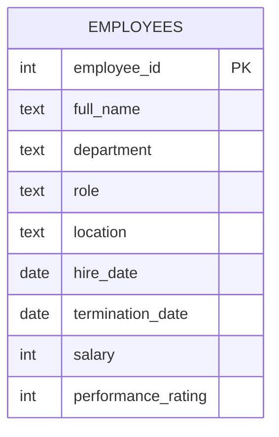

    # HR Attrition & Pay Equity (Segmentation, Cleaning, QA Tests)

    ## What this project demonstrates
    - Cleaning inconsistent categories (department casing/spacing)
- Attrition rate by department/location
- Tenure calculations
- Pay equity comparisons by role/location
- Data quality checks (nulls, bad dates, outliers)

    ## Business questions answered
    - What is the attrition rate by department and location?
- Which segments have the shortest average tenure?
- Are there pay gaps by role/location?
- Which employees are salary outliers (potential data issues)?

    ## How to run (SQLite)
    1. Create `02_hr_attrition/hr.db`
2. Run `sql/sqlite/01_create_tables.sql`
3. Import `data/raw/employee_roster.csv`
4. Run `03_cleaning.sql` then `04_analysis.sql`

    ## How to run (PostgreSQL)
    1. Run `sql/postgres/01_create_tables.sql`
2. Load `data/raw/employee_roster.csv` via `02_load_data.sql`
3. Run `03_cleaning.sql` then `04_analysis.sql`

    ## Deliverables to screenshot for your GitHub page
    - Schema (table list + key columns)
    - 2–3 KPI result tables (from `04_analysis.sql`)
    - One “insight” query output (top segment / churn drivers / no-show drivers)

## Schema (ERD)

## Recruiter highlights (copy/paste to resume)
- Standardized HR dimensions (department casing/spacing, trimmed text fields) and handled missing values with documented rules.
- Computed attrition rates by department/location and tenure for terminated employees.
- Assessed pay equity using median/average compensation by role and location; flagged salary outliers for review.
- Implemented SQL data quality tests (invalid dates, missing categories, rating constraints).
