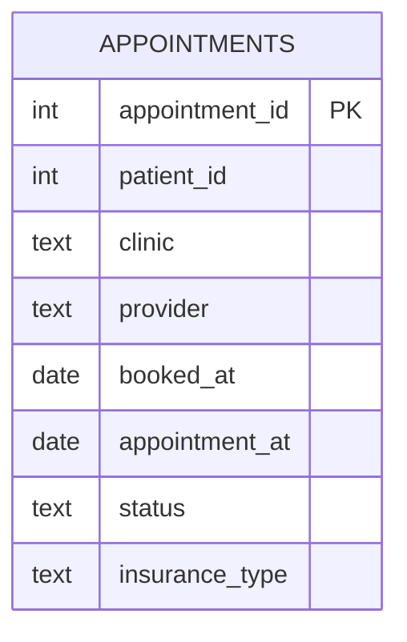

    # Healthcare Appointments (No-Show/Cancellation Drivers + Feature Engineering)

    ## What this project demonstrates
    - Datetime parsing + lead time calculations
- No-show and cancellation rates by clinic/provider/day-of-week
- Feature engineering in SQL (lead time buckets, prior no-show count)
- QA tests for bad dates and blank providers

    ## Business questions answered
    - What is the no-show rate by clinic/provider?
- Do no-shows increase with short lead time?
- Which days of week see more cancellations?
- Who are repeat no-show patients?

    ## How to run (SQLite)
    1. Create `03_healthcare_appointments/health.db`
2. Run `sql/sqlite/01_create_tables.sql`
3. Import `data/raw/appointments.csv`
4. Run `03_cleaning.sql` then `04_analysis.sql`

    ## How to run (PostgreSQL)
    1. Run `sql/postgres/01_create_tables.sql`
2. Load CSV via `02_load_data.sql`
3. Run `03_cleaning.sql` then `04_analysis.sql`

    ## Deliverables to screenshot for your GitHub page
    - Schema (table list + key columns)
    - 2–3 KPI result tables (from `04_analysis.sql`)
    - One “insight” query output (top segment / churn drivers / no-show drivers)

## Schema (ERD)

## Recruiter highlights (copy/paste to resume)
- Cleaned appointment operational data (trim, status normalization, provider blanks standardized to 'Unknown' for grouping).
- Engineered analytic features (lead time in days, lead-time buckets) to study no-show and cancellation behavior.
- Quantified no-show rates by clinic/provider and identified high-risk segments for scheduling interventions.
- Added SQL data checks for invalid date sequences and missing critical fields.
