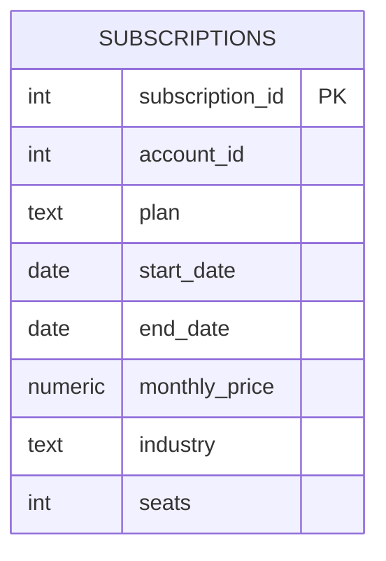

    # SaaS Subscriptions (MRR, Churn, Retention, Cohorts)

    ## What this project demonstrates
    - Subscription lifecycle modeling
- Monthly active subs + MRR
- Churn and retention
- Cohort retention by start month
- Window functions for month-over-month changes

    ## Business questions answered
    - What is MRR by month?
- What is monthly churn rate?
- Which industries churn the most?
- What does cohort retention look like by start month?

    ## How to run (SQLite)
    1. Create `04_saas_subscriptions/saas.db`
2. Run `sql/sqlite/01_create_tables.sql`
3. Import `data/raw/subscriptions.csv`
4. Run `03_cleaning.sql` then `04_analysis.sql`

    ## How to run (PostgreSQL)
    1. Run `sql/postgres/01_create_tables.sql`
2. Load CSV via `02_load_data.sql`
3. Run `03_cleaning.sql` then `04_analysis.sql`

    ## Deliverables to screenshot for your GitHub page
    - Schema (table list + key columns)
    - 2–3 KPI result tables (from `04_analysis.sql`)
    - One “insight” query output (top segment / churn drivers / no-show drivers)

## Schema (ERD)

## Recruiter highlights (copy/paste to resume)
- Modeled subscription lifecycle data and cleaned plan/industry fields with clear, documented rules.
- Calculated monthly active subscriptions and MRR using a generated month calendar (recursive CTE in SQLite / generate_series in Postgres).
- Measured churn volumes by month and segmented churn by industry.
- Built cohort retention analysis to track account retention over time for product and revenue strategy.
